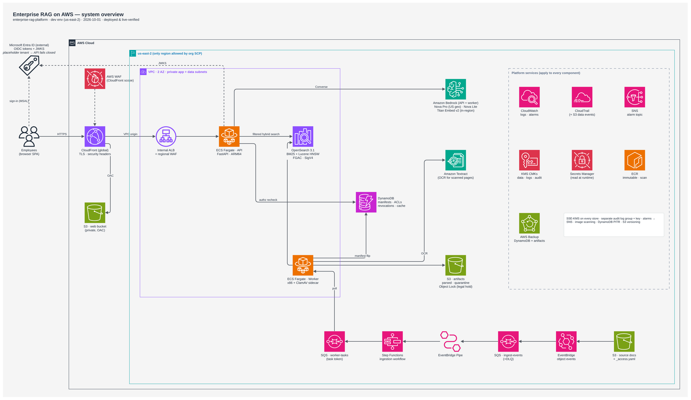
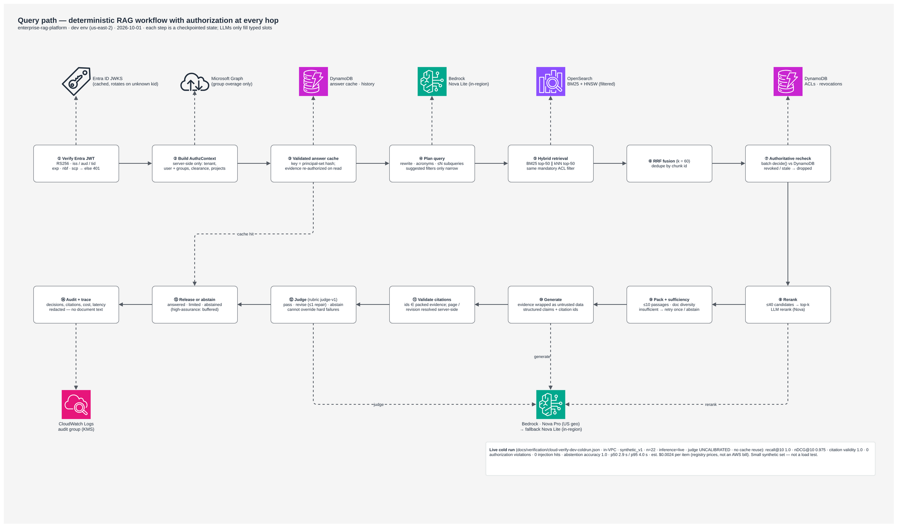
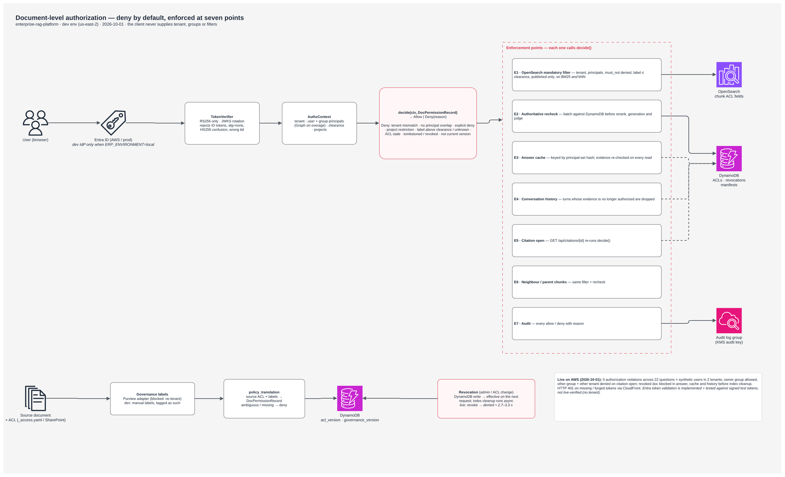
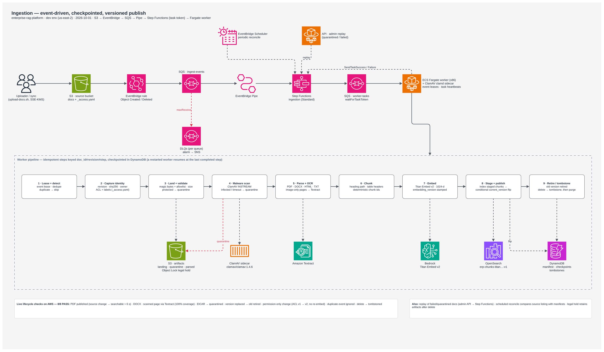
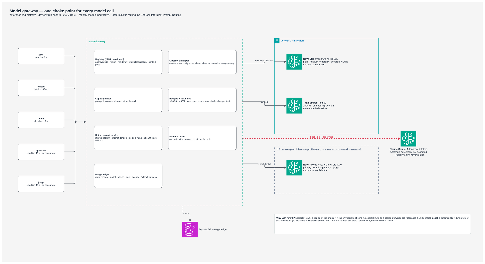
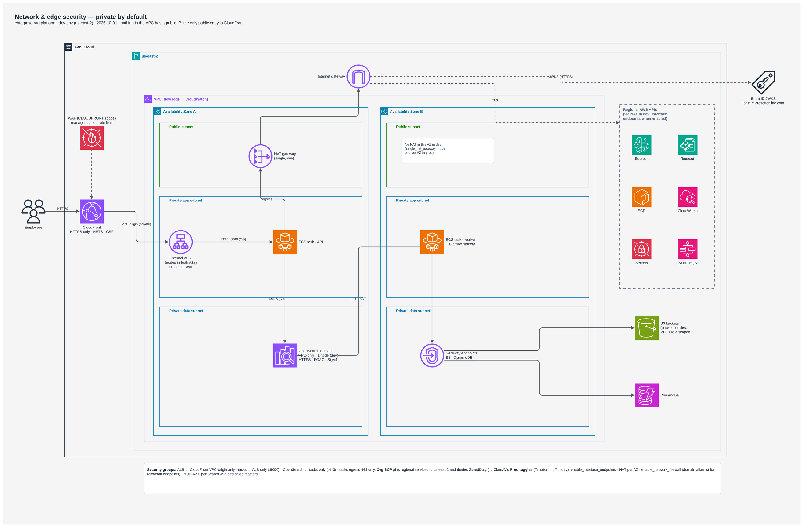
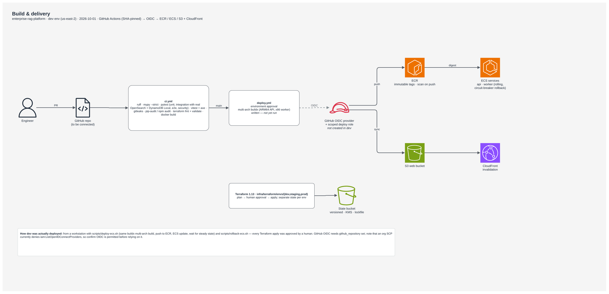
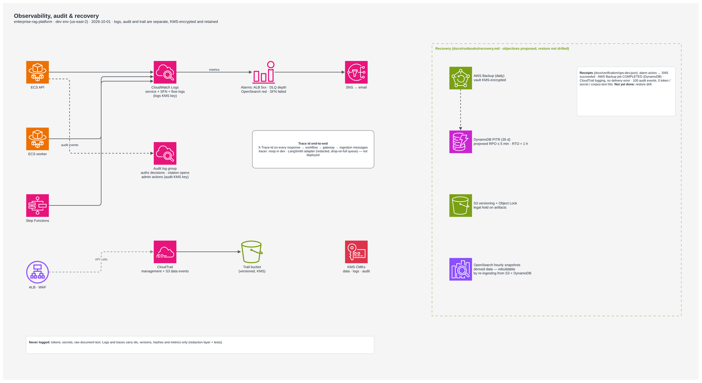
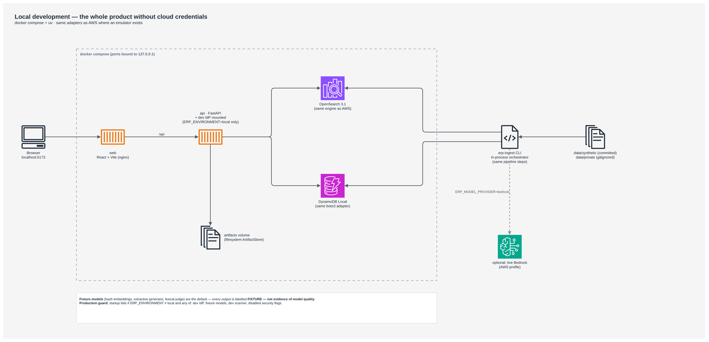
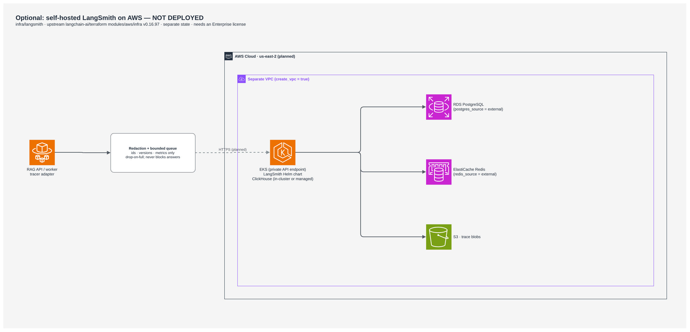

<div align="center">

# Enterprise RAG on AWS

### Enterprise knowledge, with permissions carried all the way to the answer.

**A full-stack, permission-aware retrieval platform built by Abhishek Shah.**

Python · FastAPI · React · TypeScript · Amazon Bedrock · OpenSearch · DynamoDB · ECS Fargate · Terraform

[Portfolio page](https://abh2050.github.io/enterprise-rag-aws/) · [Architecture](docs/architecture.md) · [Verification evidence](docs/verification/README.md) · [Source guide](docs/repository-guide.md) · [Interview walkthrough](docs/portfolio-walkthrough.md)

</div>

Enterprise search gets difficult when documents change, access is revoked, models fail, and old answers remain in caches. This project addresses those problems together: ingest and classify documents, retrieve only eligible evidence, recheck authoritative permissions, generate cited answers, and preserve an auditable path through the system.

The result is an application with a React research interface, a FastAPI service, a checkpointed ingestion pipeline, a policy-controlled model gateway, an evaluation harness, and modular AWS infrastructure. Its central design choice is simple: **OpenSearch finds candidates; DynamoDB decides whether they can still be used.**

> **Evidence snapshot — 1 October 2026.** AWS dev was deployed in `us-east-2`, verified, and **torn down the same day** to stop billing, so there is no live URL. `terraform apply` in `infra/terraform/envs/dev` recreates it. The verification reports record a live Bedrock evaluation, ingestion lifecycle checks, edge checks, and infrastructure checks. Real Entra sign-in, Microsoft integrations, production scale, and human-calibrated answer quality remain unverified. These reports were reviewed and preserved during this documentation update; AWS tests were not re-executed. See the [evidence and limitations](docs/verification/README.md).

## Contents

- [Project highlights](#project-highlights)
- [What has been built](#what-has-been-built)
- [AWS architecture](#aws-architecture)
- [Query and answer workflow](#query-and-answer-workflow)
- [Authorization and governance](#authorization-and-governance)
- [Document ingestion and lifecycle](#document-ingestion-and-lifecycle)
- [Model gateway](#model-gateway)
- [Application experience and API](#application-experience-and-api)
- [Data model and configuration](#data-model-and-configuration)
- [Local quickstart](#local-quickstart)
- [Verification and evaluation](#verification-and-evaluation)
- [Infrastructure, delivery, and operations](#infrastructure-delivery-and-operations)
- [Engineering decisions and deployment lessons](#engineering-decisions-and-deployment-lessons)
- [Repository map](#repository-map)
- [Architecture diagram library](#architecture-diagram-library)
- [Remaining work](#remaining-work)
- [Documentation library](#documentation-library)

## Project highlights

| Evidence | Recorded result | Scope |
|---|---|---|
| Live retrieval and answer evaluation | **22 questions · 7 scenario checks passed** | Live Bedrock and AWS data stores; synthetic documents and principals |
| Retrieval ranking | **1.0 recall@10 · 0.9754 nDCG@10** | Small synthetic set, not a general quality benchmark |
| Citation and authorization checks | **100% citation validity · 0 observed authorization violations** | Evidence-reference integrity and tested authorization cases |
| Infrastructure posture | **58/58 checks passed** | Repository-defined configuration checks; not compliance certification |
| Edge verification | **12/12 checks passed** | CloudFront, private origin, API health, headers, WAF and unauthenticated rejection |
| Ingestion lifecycle | **8/8 checks passed** | PDF/DOCX, Textract OCR, ClamAV quarantine, versions, ACL changes, duplicates and deletion |

Every result above is traceable to a [preserved report](docs/verification/README.md). The live job did **not** authenticate through Entra. The judge is **uncalibrated**. The ECR posture check reported no critical findings but did record high and medium findings.

## What has been built

| Layer | Implementation | Where to inspect |
|---|---|---|
| User experience | Synthetic local sign-in, MSAL integration path, conversations, standard/high-assurance modes, citation inspector, source freshness, revision/conflict indicators, feedback | [`apps/web`](apps/web) |
| HTTP API | Typed requests, bearer-token verification, server-built authorization, question answering, history, citations/downloads, feedback, admin lifecycle controls, health/readiness | [`apps/api/erp_api/main.py`](apps/api/erp_api/main.py) |
| Identity and policy | RS256/JWKS verification, tenant/audience/scope checks, group-overage adapter, explicit deny, clearance, project restrictions, stale-ACL denial | [`packages/auth`](packages/auth) |
| Retrieval | BM25 + filtered k-NN, reciprocal rank fusion, deduplication, authoritative recheck, model-admissibility filtering, reranking, context packing | [`packages/rag/erp_rag/retrieval.py`](packages/rag/erp_rag/retrieval.py) |
| Answer workflow | Typed planning, durable state transitions, evidence sufficiency, bounded retry, structured generation, citation validation, judge and bounded repair | [`packages/rag/erp_rag/service.py`](packages/rag/erp_rag/service.py) |
| Model operations | Versioned approved-model registry, classification ceilings, fallback chains, timeouts, retries, concurrency, circuit breakers, token/cost budgets, usage records | [`packages/rag/erp_rag/gateway`](packages/rag/erp_rag/gateway) |
| Ingestion | Source adapters, version-pinned capture, scan, parse/OCR, structure-aware chunks, staged publication, retirement, quarantine/replay, reconciliation | [`services/ingestion`](services/ingestion), [`packages/connectors`](packages/connectors) |
| Governance | Separate source ACL and classification inputs; manual manifests; Graph/Purview adapters with conservative permission translation | [`policy_translation.py`](packages/auth/erp_auth/policy_translation.py), [`purview.py`](packages/connectors/erp_connectors/purview.py) |
| Observability | Trace propagation, redacted bounded export, dedicated security audit sink, optional LangSmith exporter | [`packages/observability`](packages/observability) |
| Cloud platform | 14 Terraform module directories, dev/staging/prod roots, private compute/search, encrypted stores, queues, workflow orchestration, edge protection, backups and delivery roles | [`infra/terraform`](infra/terraform) |
| Quality tooling | Unit/integration/security/e2e/cloud tests, synthetic corpus, evaluation metrics, scenario tests, human-label calibration tooling | [`tests`](tests), [`evals`](evals) |

## AWS architecture

[](docs/diagrams/01-system-overview.drawio.png)

*Click diagrams for full resolution. Editable draw.io sources are in [docs/diagrams](docs/diagrams). Each result figure on a diagram is backed by a file in [verification evidence](docs/verification/README.md), which controls the documented result claims.*

**Serving path:** browser → CloudFront/WAF → private VPC origin → internal ALB → ECS Fargate API → OpenSearch, DynamoDB and Bedrock. CloudFront also serves the SPA from a private S3 origin using origin access control.

**Ingestion path:** S3 object event → EventBridge → SQS event queue → EventBridge Pipe → Step Functions Standard → SQS task queue with a callback token → Fargate worker → ClamAV, parsing/Textract, Titan embeddings, staged OpenSearch chunks and DynamoDB publication records.

**Operational foundation:** IAM task roles, separate KMS keys for data/logs/audit, Secrets Manager, ECR, CloudWatch, CloudTrail, SNS, AWS Backup, S3 versioning/Object Lock, and DynamoDB point-in-time recovery.

### How the AWS services fit together

| Service | Role in this project | Design detail |
|---|---|---|
| CloudFront + S3 | Serve the React application and forward API traffic | Private web bucket; security headers; VPC origin for API |
| WAF + internal ALB | Inspect and route incoming requests | Regional and edge controls; ALB is not internet-facing |
| ECS Fargate | Run API and ingestion workers | ARM64 API; x86 worker with ClamAV sidecar; private task networking |
| Amazon Bedrock | Plan, embed, rerank, generate and judge | Titan V2 embeddings; Nova routes controlled by YAML policy |
| Amazon OpenSearch Service | Lexical and vector retrieval | Engine 3.1; Lucene filtered k-NN; SigV4/FGAC; derived index |
| DynamoDB | Authoritative permissions and application state | Nine tables; conditional writes, KMS, PITR and expiring records |
| Amazon S3 | Sources, artifacts and configuration | Versioning; encrypted document buckets; artifact legal holds |
| EventBridge + Pipes | Detect and deliver source changes | Separate source events from worker execution |
| SQS | Buffer events and worker tasks | Encrypted queues, visibility/heartbeat handling and DLQs |
| Step Functions | Coordinate ingestion | Standard workflow; `waitForTaskToken` callback pattern |
| Amazon Textract | Extract scanned PDF pages | OCR fallback integrated with extraction coverage |
| KMS + Secrets Manager | Encrypt state and retrieve credentials | Separate cryptographic domains; secrets read at runtime |
| CloudWatch + CloudTrail | Service telemetry, security audit and API activity | Distinct audit log group; alarms; document-bucket data events |
| ECR + GitHub OIDC | Package and deliver the application | Multi-architecture images; immutable tags; optional short-lived deployment role |
| AWS Backup | Back up selected state/artifacts | Daily plan; restore drills remain a separate readiness requirement |

**Dev tradeoffs are explicit.** The VPC spans two AZs, but dev OpenSearch is a single node and is not highly available. Dev uses one NAT gateway and disables interface endpoints and Network Firewall to reduce fixed cost; S3/DynamoDB gateway endpoints remain configured. Staging/prod configurations exist but are not recorded as deployed.

## Query and answer workflow

[](docs/diagrams/02-query-path.drawio.png)

1. **Verify identity.** Validate the bearer token, then derive tenant, user, groups, clearance and projects on the server. Request schemas reject extra authorization fields.
2. **Revalidate reused work.** Answer-cache entries and prior conversation turns must still be backed by authorized, current evidence.
3. **Plan within bounds.** Build a typed retrieval plan with standalone wording, acronym expansion, exact identifiers and limited subqueries. Planner suggestions can narrow metadata constraints; they cannot replace authorization filters.
4. **Retrieve through both search legs.** BM25 and k-NN run concurrently with the same mandatory authorization prefilter.
5. **Fuse and recheck.** Reciprocal rank fusion combines results; deduplication removes repeated chunks/content. DynamoDB decides whether every candidate remains readable before it is sent to reranking or generation.
6. **Rerank and pack.** Apply model classification limits, rerank candidates, expand eligible same-version neighboring context, preserve table headers, and pack a diverse evidence set within the token budget.
7. **Assess evidence.** Retry retrieval at most once when necessary. Return an abstention when sufficient evidence cannot be established.
8. **Generate and validate.** Treat source text as untrusted data. Require structured claims with evidence IDs. Drop invalid claims and resolve citation metadata on the server.
9. **Judge and release.** Standard mode can sample asynchronous judging. High-assurance mode waits for the judge and permits at most one repair cycle; judge failure fails closed.

The workflow is an explicit [state machine](packages/rag/erp_rag/workflow.py) with durable checkpoints. Application code chooses transitions; models fill typed outputs. Both modes return buffered JSON responses—**token streaming is not implemented**.

### Retrieval defaults

| Setting | Value |
|---|---:|
| BM25 / vector top-k | 50 / 50 |
| RRF constant | 60 |
| Rerank candidate limit | 40 |
| Final evidence passages | 10 |
| Passages per document | 3 |
| Context token budget | 6,000 |
| Maximum subqueries | 3 |
| Retrieval retries / repair cycles | 1 / 1 |

These are versioned starting settings in [`retrieval.v1.yaml`](config/retrieval.v1.yaml), not tuned production optima.

## Authorization and governance

[](docs/diagrams/05-authorization-enforcement.drawio.png)

The policy engine evaluates a trusted `AuthzContext` against an authoritative `DocPermissionRecord`. It denies access for a missing record, tenant mismatch, revocation, unpublished or outdated version, incomplete/stale ACL, explicit deny, missing grant, project restriction, unknown classification, or insufficient clearance.

| Surface | Enforcement |
|---|---|
| BM25 and vector search | Mandatory tenant, principal, classification, project and publication filters |
| Retrieved candidates | DynamoDB recheck before candidate text reaches the reranker or generator |
| Neighbor expansion | Filtered, same document version and section; cannot widen the evidence to another document |
| Answer cache | Principal-sensitive cache key plus evidence reauthorization on every read |
| Conversation history | Revalidate cited documents; withhold inaccessible turns before reuse |
| Citation opening | Fresh policy decision for the citation's document/version |
| Original-document download | Fresh policy decision and server-controlled artifact retrieval |

**Revocation does not wait for index cleanup.** Updating the authoritative record blocks subsequent uses that perform the policy check even if stale text remains in the search index. The recorded AWS scenario observed a 3.35-second revocation check delay; that is one scenario, not a service-level guarantee. Group-membership caching and token freshness are separate identity concerns.

**Classification never grants access.** Source ACLs say who may read; governance metadata says what sensitivity constraints apply. Manual `_access.yaml` labels are explicitly marked `governance_source=manual`. Purview is an implemented adapter, not a claim that live Purview governance was tested.

**Conservative Microsoft translation.** The SharePoint adapter supports recognizable Entra user/group grants and denies unsupported sharing-link or ambiguous permission shapes. Graph group-overage failures return an unavailable/fail-closed response rather than assuming membership. See the [threat model](docs/threat-model.md) and [Microsoft integration status](docs/integration-status.md).

## Document ingestion and lifecycle

[](docs/diagrams/03-ingestion-pipeline.drawio.png)

The common pipeline serves local files, S3, and the implemented SharePoint connector:

```text
detect → capture → land → validate → scan → parse → normalize → chunk
       → attach permissions/governance → embed → stage → publish → retire
```

- **Input handling:** PDF, DOCX, HTML, Markdown and text; extension/magic checks, size/page limits, DOCX archive expansion guards and protected-content quarantine.
- **Extraction:** PDF headings/tables and page coverage, DOCX headings/tables, HTML script stripping and image coverage reporting, and Textract OCR for scanned PDF pages.
- **Chunking:** heading boundaries, section/page provenance, table fragments with repeated headers, deterministic IDs and previous/next links.
- **Idempotency:** deterministic event IDs, leases, per-step checkpoints and artifact reload on restart.
- **Publication:** index new chunks as staged, conditionally advance the DynamoDB `current_version`, mark chunks published, then retire the old version. Readers check the authoritative version, preferring a temporary gap over mixed-version evidence.
- **Permission-only updates:** refresh grants/denies and ACL version without treating the document as unrelated new content.
- **Deletion:** tombstone/revoke the authoritative record first, then purge derived search data. Preserve artifacts when legal hold applies.
- **Recovery:** quarantine uncertain or unsafe content; replay after correction; reconcile source state to recover missed events.

The AWS worker manages SQS callback messages, heartbeats and Step Functions task outcomes. The live lifecycle report records successful PDF/DOCX publication, OCR, EICAR quarantine, replacement/retirement, ACL-only updates, duplicate-event handling and source deletion.

## Model gateway

[](docs/diagrams/06-model-gateway.drawio.png)

All model work passes through a single [`ModelGateway`](packages/rag/erp_rag/gateway/gateway.py). Its versioned registry defines approved models, supported tasks, region/residency metadata, classification ceilings, context limits, prices and fallback order.

| Task | Configured route | Notes |
|---|---|---|
| Planning | Nova Lite, in-region | Typed bounded plan |
| Embeddings | Titan Embed Text V2 | 1,024 dimensions; embedding version included in index naming |
| Reranking | Nova Pro → Nova Lite | LLM-scored Converse path; dedicated Rerank API was unavailable under account constraints |
| Generation | Nova Pro → Nova Lite | Structured evidence-linked claims |
| Judging | Nova Pro → Nova Lite | Separate rubric; may tighten the result, never override deterministic rejection |
| Local development | Deterministic fixture provider | No paid API calls; explicitly marked FIXTURE |

The gateway applies approval/classification/context checks, per-task deadlines, per-attempt timeouts, bounded retries, concurrency limits and circuit breaking. It records model choice, route reason, usage, estimated cost, latency and fallback outcome. The Bedrock registry sets a **$0.50 estimated cost ceiling and 300,000-token request budget**; the fixture registry is separate. Prices are placeholders, so estimated cost is not billing evidence.

Nova Pro uses a US inference profile and is capped at confidential evidence in this registry. Nova Lite and Titan are in-region routes with restricted-data ceilings. This expresses the configured policy; actual destination permissions and organizational residency requirements must still be reviewed. The Claude entry is disabled pending model access. See [`models.bedrock.yaml`](config/models.bedrock.yaml).

## Application experience and API

The React application includes a conversation view, source citations with section/location and ACL freshness, original-document access, revision/conflict indicators, explicit abstentions, feedback and standard/high-assurance selection. Local synthetic sign-in makes authorization differences easy to demonstrate. An MSAL path is implemented for Entra integration.

| Method | Route | Purpose |
|---|---|---|
| GET | `/healthz`, `/readyz` | Liveness; OpenSearch and DynamoDB readiness |
| GET | `/api/me` | Server-derived user context and inference mode |
| POST | `/api/ask` | Answer a question with optional conversation and mode |
| GET | `/api/conversations/{conversation_id}` | Revalidated conversation history |
| GET | `/api/citations/{chunk_id}` | Authorized evidence and source metadata |
| GET | `/api/documents/{document_id}/download` | Authorized original artifact |
| POST | `/api/feedback` | Rating and optional categorized feedback |
| GET | `/api/admin/documents` | Same-tenant admin document inventory |
| POST | `/api/admin/documents/{document_id}/revoke` | Revoke access with an audit reason |
| DELETE | `/api/admin/documents/{document_id}` | Tombstone a document with an audit reason |
| POST | `/api/admin/documents/{document_id}/replay` | Replay ingestion locally or through AWS orchestration |

The API adds trace IDs and defensive response headers. Missing and unauthorized citation/download resources share a 404 response. Dev identity routes and interactive API docs are restricted to local configurations. Production startup rejects unsafe development components and security settings.

## Data model and configuration

| DynamoDB table | Responsibility |
|---|---|
| `documents` | Tenant/document permission record, current version, status, revocation and governance |
| `chunk_manifest` | Document-version chunk mapping, extraction coverage and artifact references |
| `workflow` | Query/ingestion checkpoints and asynchronous judge outcomes |
| `conversations` | User-scoped turns with cited evidence |
| `answer_cache` | Expiring answers that require revalidation |
| `feedback` | User/run feedback |
| `usage` | Model routing and estimated usage/cost ledger |
| `events` | Ingestion event leases and outcomes |
| `connector_state` | Source synchronization cursors |

OpenSearch stores derived chunks, vectors and ACL copies. S3 or the local artifact store holds landing, parsed and quarantine artifacts. This separation makes the search index rebuildable while permissions remain authoritative in DynamoDB.

Configuration is explicit and versioned: [`retrieval.v1.yaml`](config/retrieval.v1.yaml), [`models.bedrock.yaml`](config/models.bedrock.yaml), [`models.fixture.yaml`](config/models.fixture.yaml), [`entitlements.yaml`](config/entitlements.yaml), [`governance-map.v1.yaml`](config/governance-map.v1.yaml), [`acronyms.yaml`](config/acronyms.yaml) and [`dev-directory.yaml`](config/dev-directory.yaml). Runtime settings are documented in [`.env.example`](.env.example) and validated by [`Settings`](packages/rag/erp_rag/config.py).

## Local quickstart

Prerequisites: Docker with Compose, Python 3.12, `uv`, and Node.js 22+ with npm.

```bash
git clone https://github.com/abh2050/enterprise-rag-aws.git
cd enterprise-rag-aws
make install
make up
```

Open **http://localhost:5173**. Local API documentation is at **http://localhost:8000/api/docs**. `make up` starts local dependencies and application containers and attempts ingestion. Because that target tolerates ingestion errors, check the ingestion output or run `make status` if no documents appear.

Try the synthetic identities:

| User | Demonstration |
|---|---|
| Alice — Acme finance | Ask: “What is the per diem for New York under the travel and expense policy?” |
| Bob — Acme engineering | Repeat the finance question; then ask: “What are the RPO and RTO for tier-1 services?” |
| Carol — Globex | Demonstrate isolation from Acme documents |

Local answers use **deterministic fixture models**. This demonstrates pipeline behavior and authorization; it is not a live Bedrock demo or evidence of model quality.

For host development, run `make up-deps` and `make ingest`, then `make dev-api` and `make dev-web` in separate terminals. Stop containers with `make down`.

### Ingest your own documents

Place files under `data/private/<collection>/`, copy [`data/private/_access.example.yaml`](data/private/_access.example.yaml) to that collection as `_access.yaml`, and configure its tenant, grants and labels. Run `make ingest`. Private documents and generated local artifacts are gitignored. Missing or invalid access metadata does not create public access.

Useful CLI commands:

```bash
uv run erp-ingest sync --source all
uv run erp-ingest status --tenant 11111111-1111-4111-8111-111111111111
uv run erp-ingest reconcile --source localfs-synthetic --tenant 11111111-1111-4111-8111-111111111111
uv run erp-ingest replay-event EVENT_ID
```

### View this documentation as a website

Open root [`index.html`](index.html), or serve the repository with `python3 -m http.server 8080` and visit `http://localhost:8080`. The portfolio uses relative diagram assets and needs no npm build. It is separate from the application entry point at `apps/web/index.html`. GitHub Pages can serve it from `main` at `/`.

## Verification and evaluation

```bash
make test                 # deterministic unit/integration/e2e/security tests
make lint typecheck       # Ruff and strict mypy
make web-check            # lint, TypeScript, Vitest and production web build
make tf-fmt tf-validate   # formatting and validation; no Terraform apply
make eval                 # SIMULATED fixture evaluation
```

`make test` starts local OpenSearch and DynamoDB dependencies. Cloud tests and live Bedrock calls are opt-in and excluded from the deterministic suite. To intentionally exercise paid model APIs in a configured environment, use `RUN_LIVE_BEDROCK=1 make live-bedrock`; consult [deployment](docs/runbooks/deploy.md) first.

| Test area | Coverage examples |
|---|---|
| Unit | Policy, parsing, retrieval/fusion, model routing, output validation, S3 artifacts, worker mapping, ClamAV protocol, redaction |
| Security | Forged/incorrect tokens, tenant boundaries, production safety, revocation, cache/history revalidation |
| Integration | Real local OpenSearch prefiltering, DynamoDB lifecycle, restart/idempotency, staged versions, quarantine/replay, judge failure |
| End-to-end | API authorization slice, citation/download isolation, synthetic identity behavior |
| Web | React interactions and accessibility checks |
| Cloud | Bedrock contract/live smoke paths and managed environment checks |

The evaluation harness reports retrieval recall/nDCG, expected-source citations, citation validity, authorization violations, injection-string hits, abstention behavior, latency, estimated cost, ingestion freshness and revocation delay. It preserves dataset/config identifiers and labels fixture versus live inference. [Calibration tooling](evals/calibration/README.md) supports human-label comparison and Cohen's kappa; calibration has not been completed.

**Read latency honestly:** the preserved live run has a mixed-path p50 of 45.37 ms and p95 of 3.56 s, including reused work and zero-cost items. Those values are not a fresh-generation or concurrency benchmark. The cold-path reference is the [earlier run](docs/verification/cloud-verify-dev-coldrun.json) on the previous image. There, every item was computed with no cache reuse: p50 2.88 s, p95 4.01 s, about $0.0024 estimated per item, from 22 synthetic questions run sequentially. It is still not a load or concurrency benchmark.

## Infrastructure, delivery, and operations

[](docs/diagrams/04-network-security.drawio.png)

The Terraform `stack` composes `network`, `kms`, `storage`, `dynamodb`, `ecr`, `secrets`, `edge`, `ingestion`, `observability`, `ecs`, `opensearch`, `backup`, and optional `github_oidc` modules. Environment roots separate dev, staging and prod configuration/state. `infra/langsmith` is an independent optional deployment.

[](docs/diagrams/08-cicd-delivery.drawio.png)

**CI:** [GitHub Actions](.github/workflows/ci.yml) defines Python checks, local-service tests, fixture evaluation, dependency auditing, secret scanning, web checks, Terraform validation and multi-architecture image builds. These are workflow definitions; a successful hosted run must be checked in Actions rather than inferred from their presence.

**Delivery:** the manually dispatched [deployment workflow](.github/workflows/deploy.yml) assumes an environment-specific AWS role through OIDC, publishes an image, rolls ECS services, builds the SPA and invalidates CloudFront. Terraform apply is separate. The recorded dev deployment used workstation scripts; GitHub OIDC/environment configuration still requires setup. This documentation's root `index.html` is not the React SPA deployed by that workflow.

**Operations:** trace IDs span API/workflow/model/ingestion work. Redaction and bounded queues isolate telemetry from answer serving. Security audit events have a dedicated sink and KMS key. CloudWatch alarms, DLQs, CloudTrail, backups and rollback scripts support troubleshooting and recovery.

[](docs/diagrams/07-observability-recovery.drawio.png)

Recovery documentation covers DynamoDB restore, rebuilding the derived search index, replaying ingestion, and credential rotation. **Restore authorization state carefully:** revocations after a restore point must be reapplied before traffic resumes. Proposed RPO/RTO values are objectives, not demonstrated recovery guarantees. Cross-region disaster recovery is not implemented.

The [cost-driver document](docs/cost-drivers.md) contains historical estimates and identifies OpenSearch, NAT, Fargate, ALB/WAF and observability as fixed-cost drivers. It is not a current quote. Registry-derived model cost is also an estimate, not invoice data.

## Engineering decisions and deployment lessons

| Decision / incident | Implementation and lesson |
|---|---|
| Search ACLs can become stale | Use search prefilters plus authoritative DynamoDB checks; treat the index as derived state |
| Lexical identifiers and semantic questions both matter | Fuse BM25 and vector results with app-side RRF while keeping both filters explicit and testable |
| Models should not choose arbitrary execution paths | Use typed outputs within a deterministic, checkpointed workflow |
| Organization policies restricted service choices | Deploy in Ohio; use Nova/Titan, Converse-based reranking and ClamAV where alternatives were blocked |
| Publishing can expose partial revisions | Stage chunks, conditionally flip the current version, and reject stale versions on reads |
| Empty secret injection prevented task startup | Read secrets by ARN at runtime when the integration needs them |
| Bucket encryption policy rejected artifact writes | Send the required SSE-KMS header explicitly; guard it with a unit test |
| Event delivery failed on encrypted SQS | Add the required service-principal KMS grants; infrastructure existence alone does not prove the event path works |
| Terraform encountered apply-time identifiers | Use stable map keys for resource iteration rather than unknown security-group IDs |
| Expired credentials interrupted provisioning | Recover state deliberately and use refreshing credentials; preserve the deployment record |
| API authentication and worker ingestion have different needs | Distinguish service roles so ingestion can run without mounting a development identity provider in AWS |

These incidents and decisions are recorded in [the progress log](docs/progress.md). The [portfolio walkthrough](docs/portfolio-walkthrough.md) turns them into an interview-ready architecture and demo narrative.

## Repository map

```text
enterprise-rag-aws/
├── README.md                     Project overview and technical documentation
├── index.html                    Standalone portfolio/documentation page
├── apps/
│   ├── api/                      FastAPI application and container
│   └── web/                      React/TypeScript UI, MSAL, tests, nginx/container
├── packages/
│   ├── auth/                     Identity, directory, policy and governance translation
│   ├── rag/                      Workflow, retrieval, models, citations, stores and settings
│   ├── connectors/               Local/S3/SharePoint, parsing, scanning, OCR and artifacts
│   └── observability/            Audit, tracing, redaction and LangSmith export
├── services/ingestion/           Checkpointed pipeline, wiring, CLI and SQS worker
├── config/                       Versioned retrieval, model, identity and governance policy
├── data/                         Synthetic corpus and ignored private-document workspace
├── evals/                        Dataset, runner, rubric, calibration and simulated reports
├── tests/                        Unit, integration, security, e2e and opt-in cloud tests
├── infra/
│   ├── terraform/                Reusable AWS modules and dev/staging/prod roots
│   └── langsmith/                Optional separate self-hosted deployment
├── scripts/                      Deploy, rollback, upload, verification and diagram tools
├── docs/                         Design, runbooks, evidence, diagrams and portfolio walkthrough
└── .github/workflows/            CI and manually dispatched application delivery
```

For file-level orientation, see the [repository guide](docs/repository-guide.md).

## Architecture diagram library

All ten existing AWS diagrams are embedded here or below and available in the portfolio gallery. Each PNG has an editable `.drawio` companion. See the [diagram index](docs/diagrams/README.md) for scope and evidence notes.

| Diagram | Editable source |
|---|---|
| [01 — System overview](docs/diagrams/01-system-overview.drawio.png) | [draw.io](docs/diagrams/01-system-overview.drawio) |
| [02 — Query path](docs/diagrams/02-query-path.drawio.png) | [draw.io](docs/diagrams/02-query-path.drawio) |
| [03 — Ingestion pipeline](docs/diagrams/03-ingestion-pipeline.drawio.png) | [draw.io](docs/diagrams/03-ingestion-pipeline.drawio) |
| [04 — Network security](docs/diagrams/04-network-security.drawio.png) | [draw.io](docs/diagrams/04-network-security.drawio) |
| [05 — Authorization](docs/diagrams/05-authorization-enforcement.drawio.png) | [draw.io](docs/diagrams/05-authorization-enforcement.drawio) |
| [06 — Model gateway](docs/diagrams/06-model-gateway.drawio.png) | [draw.io](docs/diagrams/06-model-gateway.drawio) |
| [07 — Observability and recovery](docs/diagrams/07-observability-recovery.drawio.png) | [draw.io](docs/diagrams/07-observability-recovery.drawio) |
| [08 — CI/CD delivery](docs/diagrams/08-cicd-delivery.drawio.png) | [draw.io](docs/diagrams/08-cicd-delivery.drawio) |
| [09 — Local development](docs/diagrams/09-local-development.drawio.png) | [draw.io](docs/diagrams/09-local-development.drawio) |
| [10 — Optional LangSmith](docs/diagrams/10-langsmith-optional.drawio.png) | [draw.io](docs/diagrams/10-langsmith-optional.drawio) |

<details>
<summary><strong>Local development architecture</strong></summary>



</details>

<details>
<summary><strong>Optional self-hosted LangSmith — not deployed</strong></summary>



The exporter and separate Terraform root exist. The self-hosted platform needs its own provisioning and license; it is not part of the verified core dev deployment.

</details>

## Remaining work

- Complete real Entra sign-in and Graph overage tests; validate SharePoint permission completeness and Purview label mapping with a tenant.
- Evaluate a reviewed representative dataset, calibrate the judge with human labels, and test adversarial inputs beyond the synthetic examples.
- Measure throughput, fresh-answer latency, throttling behavior and model cost under concurrent load.
- Remediate the recorded container HIGH/MEDIUM findings (zlib, gcc-14 runtime, dash; no Debian fix as of 2026-10-01, see [security-scan.md](docs/security-scan.md)) and rescan; complete an independent IAM/security review.
- Exercise restore and failure recovery with retained receipts. An alarm → SNS action and a completed backup job are already recorded in [ops-dev.json](docs/verification/ops-dev.json). Confirm subscriptions and on-call escalation, and define owner-approved SLOs.
- Configure GitHub OIDC and protected environments; validate the hosted delivery workflow.
- Replace placeholder prices and governance IDs; review model lifecycle/access and residency policy before deployment.
- Deploy and validate staging/prod when required; implement cross-region recovery and streaming only if the product needs them.

This documentation update also passed **172 deterministic tests** and desktop/mobile portfolio checks; see the [review record](docs/documentation-review.md).

See [production readiness](docs/production-readiness.md) for the remaining acceptance work. This is a deployed and verified **development portfolio system**, with explicit boundaries around what the evidence establishes.

## Documentation library

| Purpose | Documents |
|---|---|
| Start here | [Portfolio](index.html), [repository guide](docs/repository-guide.md), [interview walkthrough](docs/portfolio-walkthrough.md) |
| Design | [Architecture](docs/architecture.md), [assumptions](docs/assumptions.md), [threat model](docs/threat-model.md), [diagrams](docs/diagrams/README.md) |
| Evidence | [Verification snapshots](docs/verification/README.md), [integration status](docs/integration-status.md), [progress log](docs/progress.md), [simulated evaluation](evals/reports/20261001T012326Z-synthetic_v1-simulated.md) |
| Operate | [Deploy](docs/runbooks/deploy.md), [rollback](docs/runbooks/rollback.md), [recovery](docs/runbooks/recovery.md), [limits](docs/operational-limits.md), [cost drivers](docs/cost-drivers.md) |
| Integrate | [Entra](docs/integrations/entra.md), [S3](docs/integrations/s3.md), [SharePoint](docs/integrations/sharepoint.md), [Purview](docs/integrations/purview.md), [LangSmith](docs/integrations/langsmith.md) |
| Assess readiness | [Local vs AWS](docs/local-vs-aws.md), [production readiness](docs/production-readiness.md), [source references](docs/sources.md) |

**Author:** [Abhishek Shah](https://github.com/abh2050) · [Repository](https://github.com/abh2050/enterprise-rag-aws)
